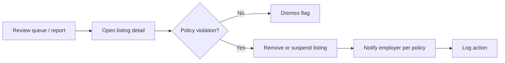

# Persona: Admin — Morgan Lee

**Project:** Job Portal MVP  
**Story:** Define User Personas and Draft Detailed User Stories (`5c02ce1a-05aa-4724-b035-e037fdef5206`)  
**Task:** Create Admin Persona (`3cb8f1ea-0c17-4282-8436-73d8f192c9c6`)  
**Version:** 1.0

---

## Snapshot

| Attribute | Detail |
|-----------|--------|
| **Name** | Morgan Lee (composite) |
| **Role** | Platform operations / trust & safety administrator |
| **Organization** | Job Portal operator (internal team) |
| **Age** | 42 |
| **Experience** | 10+ years in IT operations and compliance-adjacent SaaS support |
| **Tech comfort** | Expert — comfortable with admin consoles, logs, and policy configuration |

---

## Interview synthesis (admin stakeholder inputs)

1. **Moderation load** — Spam, discriminatory language, and duplicate listings must be actionable without engineering intervention.  
2. **Account lifecycle** — Disable abusive accounts quickly; assign roles deliberately (employer vs candidate vs admin).  
3. **Auditability** — Admin actions and authentication failures must be logged for investigations (`REQ-NFR-SEC-001`).  
4. **Reporting for leadership** — Weekly operational metrics (users, listings, applications) support compliance and capacity planning.  
5. **Least privilege** — Admin powers are broad; MFA and session hygiene expected in production (policy).  
6. **Settings without deploys** — Feature flags and limits (e.g. max upload size) should be adjustable in MVP settings where scoped.  

---

## Demographics and context

- **Reports to:** Head of Product Operations  
- **Team:** Shared on-call with engineering for Sev-2 incidents  
- **Users supported:** Hundreds of employers and thousands of candidates at MVP scale  

---

## Motivations

- Keep the marketplace trustworthy and legally defensible  
- Resolve user issues (locked accounts, mistaken roles) in minutes  
- Provide evidence for compliance questions (who changed what, when)  
- Minimize downtime and security incidents through monitoring and sane defaults  

---

## Goals

| Goal | Success signal |
|------|----------------|
| Moderate harmful content | Flagged or reported listings reviewed within SLA |
| Manage accounts safely | Create/disable users; correct roles without data leaks |
| Configure platform behavior | Update MVP settings with change audit trail |
| Report to stakeholders | Export or view standard MVP reports on demand |
| Maintain security posture | No critical findings open at release; logs complete |

---

## Daily tasks

| Time | Task | Related requirement |
|------|------|---------------------|
| Morning | Review moderation queue and overnight flags | `FR-ADM-002`, `REQ-ADM-002` |
| Mid-day | Handle account tickets (disable, role fix) | `FR-ADM-001`, `REQ-ADM-001` |
| Afternoon | Check dashboards / run reports for leadership | `FR-ADM-004`, `REQ-ADM-004` |
| As needed | Adjust system settings (limits, maintenance banner) | `FR-ADM-003`, `REQ-ADM-003` |
| Weekly | Review auth failure trends and access-denied logs | `REQ-NFR-SEC-001` |

---

## Security concerns

| Concern | Mitigation expectation (MVP) |
|---------|------------------------------|
| Privilege escalation | Strict admin-only routes; `403` on unauthorized access |
| Cross-tenant data exposure | Object-level checks on all admin views |
| Credential attacks | Rate limiting, lockout/backoff on login (`AC-S7` area) |
| Sensitive data in logs | No plaintext passwords or tokens in logs |
| Misconfiguration | Settings changes logged with actor and timestamp |
| Supply chain | Dependency scanning in CI before release (`AC-S6`) |

---

## Compliance obligations

| Obligation | Admin responsibility |
|------------|---------------------|
| **Data access requests** | Locate user account and application records; export per policy (process defined outside MVP UI if needed) |
| **Content standards** | Remove or reject listings violating posting policy |
| **Retention** | Apply documented retention for applications and logs per org policy |
| **Accessibility governance** | Track known WCAG exceptions with Product Owner approval (`AC-A1`) |
| **Incident response** | Use audit logs for auth failures and admin actions during investigations |

---

## Pain points

- Admin tools buried in engineering-only scripts  
- Moderation without context (employer history, prior flags)  
- Reports that do not match leadership’s definitions  
- Inability to disable an account immediately during abuse spikes  

---

## Typical moderation workflow

---

## Tools and technology usage

- **Primary:** Desktop admin console (Chrome), second monitor for logs  
- **Data:** CSV export for reports; no direct production DB access in MVP ideal  
- **Collaboration:** Tickets with Product Owner for policy edge cases  

---

## Quotes (representative)

> “When something’s abusive, I need one click to take it offline and a log line that proves I did it.”

> “Leadership asks for numbers every Monday — don’t make me write SQL.”

---

## Traceability

| Persona need | Requirement IDs |
|--------------|-------------------|
| User administration | `FR-ADM-001`, `REQ-ADM-001` |
| Content moderation | `FR-ADM-002`, `REQ-ADM-002` |
| System settings | `FR-ADM-003`, `REQ-ADM-003` |
| Reporting | `FR-ADM-004`, `REQ-ADM-004` |
| Security and logging | `REQ-NFR-SEC-001`, NFR §1 (`AC-S1`–`AC-S7`) |
| Specification governance | `FR-REL-001`, `REQ-DOC-001` |
