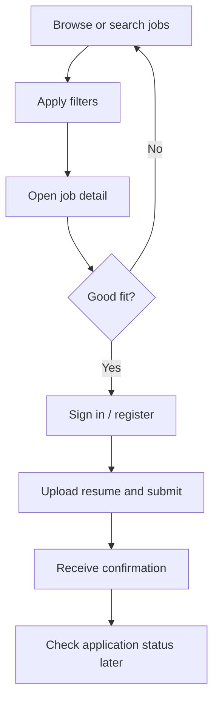

# Persona: Candidate — Priya Sharma

**Project:** Job Portal MVP  
**Story:** Define User Personas and Draft Detailed User Stories (`5c02ce1a-05aa-4724-b035-e037fdef5206`)  
**Task:** Create Candidate Persona (`9ed862c5-dc39-466e-88c0-f3919a0b08ec`)  
**Version:** 1.0  
**Canonical location:** Shared design repository (also published to [project wiki](../../wiki/personas/candidate-persona.md))

---

## Background

| Attribute | Detail |
|-----------|--------|
| **Name** | Priya Sharma (composite) |
| **Role** | Mid-career professional seeking a new opportunity |
| **Experience** | 7 years in customer success and operations |
| **Age** | 31 |
| **Location** | Denver, CO (open to remote and hybrid) |
| **Education** | Bachelor’s in Communications |
| **Situation** | Employed but actively exploring roles; applies to 2–4 jobs per week |

Priya uses job boards and company career pages during evenings and weekends. She expects a straightforward search-and-apply experience without creating duplicate profiles for every employer on the portal.

---

## Interview synthesis (candidate-focused)

1. **Search clarity** — Keyword search plus filters (location, job type) are essential; vague results waste time.  
2. **Transparent requirements** — Salary range (when provided), location, and employment type must be visible before apply.  
3. **Application friction** — Resume upload and confirmation of submission reduce anxiety; missing feedback after apply is a top frustration.  
4. **Status visibility** — She wants to see whether an application is received, under review, or closed without emailing HR.  
5. **Accessibility is non-negotiable** — Priya uses keyboard navigation and increased zoom due to mild vision strain; inaccessible forms cause abandonment.  
6. **Mobile-first moments** — Often browses jobs on phone; applying may switch to laptop for resume upload.  
7. **Trust** — Concerned about resume data handling and who can see her documents.  

---

## Goals

| Goal | Why it matters |
|------|----------------|
| Find relevant roles quickly | Limited time outside work hours |
| Understand role fit before applying | Avoid wasted applications |
| Submit complete applications once | Resume + required fields in one flow |
| Track application progress | Plan follow-ups and interviews |
| Use the site with assistive tech | Equal access to opportunities (`FR-UI-002`) |

---

## Frustrations

- Filters that reset or return irrelevant jobs  
- Apply flows that fail silently on mobile or slow networks  
- No confirmation or status after submitting an application  
- PDF resume uploads rejected without clear reason  
- Poor contrast, missing labels, or keyboard traps on forms  
- Fear that resume files are visible to unauthorized parties  

---

## Job-search behavior

**Typical session (20–30 minutes)**

1. Search by title or keyword (`FR-CAN-001`).  
2. Narrow by location and job type (`FR-CAN-002`).  
3. Read full description on job detail page.  
4. Authenticate as candidate (`FR-AUTH-001`).  
5. Apply with resume (`FR-CAN-003`).  
6. Return within a week to check status (`FR-CAN-004`).  

---

## Tech usage

| Context | Behavior |
|---------|----------|
| **Devices** | Android phone (Chrome) for search; Windows laptop for apply |
| **Assistive tech** | Screen reader occasionally; always uses keyboard and 125–150% zoom |
| **Connectivity** | Home Wi-Fi and mobile data; sensitive to slow LCP on search pages |
| **Files** | PDF resume (~400 KB); expects allowed types and size limits up front |
| **Accounts** | Prefers email + password; expects secure session logout on shared devices |

---

## Accessibility needs (MVP)

- WCAG 2.1 Level AA for search, job detail, apply, and status views (`FR-UI-002`, `REQ-NFR-A11Y-001`)  
- Visible focus, logical tab order, and labeled form fields  
- Error messages associated with inputs (`3.3.1`, `3.3.2`)  
- Status updates announced to assistive tech where status changes dynamically (`4.1.3`)  
- Responsive reflow without horizontal scrolling at 320px (`1.4.10`)  

---

## Application expectations

| Expectation | MVP alignment |
|-------------|---------------|
| Clear required fields before submit | Apply form validation |
| Upload progress and success message | Post-submit confirmation |
| View list of “My applications” | `FR-CAN-004` |
| Status labels in plain language | e.g. Submitted, Under review, Closed |
| Data privacy | Role-based access; resume only to relevant employer (`REQ-NFR-SEC-001`) |

---

## Quotes (representative)

> “Tell me the job failed to submit before I close the tab.”

> “I shouldn’t need a magnifier to read your apply button.”

---

## Traceability

| Persona need | Requirement IDs |
|--------------|-------------------|
| Search and browse | `FR-CAN-001`, `REQ-CAN-001` |
| Filters | `FR-CAN-002`, `REQ-CAN-001` |
| Apply with resume | `FR-CAN-003`, `REQ-CAN-002` |
| Application status | `FR-CAN-004`, `REQ-CAN-003` |
| Authentication | `FR-AUTH-001`, `REQ-AUTH-001` |
| Accessibility and performance | `FR-UI-002`, `REQ-NFR-A11Y-001`, `REQ-NFR-PERF-001` |
