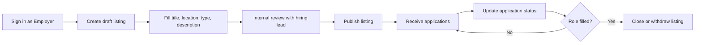

# Persona: Employer — Jordan Reyes

**Project:** Job Portal MVP  
**Story:** Define User Personas and Draft Detailed User Stories (`5c02ce1a-05aa-4724-b035-e037fdef5206`)  
**Task:** Create Employer Persona (`c4159a08-f024-4180-91e3-26fab39b6fb8`)  
**Version:** 1.0

---

## Snapshot

| Attribute | Detail |
|-----------|--------|
| **Name** | Jordan Reyes (composite) |
| **Role** | Hiring manager / small-business HR lead |
| **Organization** | Regional services company (~45 employees) |
| **Age** | 38 |
| **Location** | Austin, TX (hybrid team) |
| **Tech comfort** | High — uses SaaS daily; expects modern, mobile-capable tools |

---

## Interview synthesis (employer-focused)

Insights aggregated from employer stakeholder interviews and hiring-manager workshops:

1. **Speed over perfection for first publish** — Employers want to get a listing live quickly, then refine copy and requirements after internal review.
2. **Application volume is manageable but noisy** — They need filtering and status updates more than advanced ATS features in MVP.
3. **Trust and brand** — Job posts represent the company; broken layouts or unmoderated spam listings damage credibility.
4. **Mobile check-ins** — Jordan often reviews new applications on a phone between meetings; dashboard must work on small viewports.
5. **Clear ownership** — Only their company’s jobs and applications should be visible; cross-tenant leakage is a deal-breaker.
6. **Compliance awareness** — Equal-opportunity language and accurate job metadata matter for internal HR policy, even at MVP scale.

---

## Demographics and context

- **Education:** Bachelor’s in Business Administration  
- **Team:** Shares hiring with two department leads; no dedicated recruiter on staff  
- **Industry:** Professional services (IT support, facilities, client success roles)  
- **Hiring volume:** 3–8 open roles per quarter, 20–60 applications per role  

---

## Motivations

- Fill roles faster without paying for a full ATS during early growth  
- Present a professional careers presence to candidates  
- Keep hiring managers aligned on pipeline status (applied → reviewing → interview → offer/declined)  
- Reduce email back-and-forth by centralizing applications in one portal  

---

## Goals

| Goal | Success signal |
|------|----------------|
| Publish accurate job listings | Listing live with required fields in under 15 minutes |
| Maintain listings over time | Edit, close, or withdraw posts without support tickets |
| Triage applications efficiently | See all applicants per job with sortable status |
| Protect company data | No access to other employers’ jobs or candidates |

---

## Pain points and frustrations

- Re-entering the same job details across multiple boards  
- Candidates applying without required documents, causing manual follow-up  
- Portals that are desktop-only or slow on mobile  
- Unclear application status from the candidate side, leading to repeated inquiries  
- Fear of posting jobs that violate policy or contain outdated information  

---

## Constraints

- **Time:** Hiring is secondary to operations; workflows must be short and repeatable  
- **Budget:** MVP must avoid enterprise ATS pricing and complexity  
- **Policy:** Must support standard job fields and moderation if content is flagged  
- **Security:** Company and applicant data must stay isolated per employer account  

---

## Typical job-posting workflow

**Step detail**

1. Authenticate with employer role (`FR-AUTH-001`).  
2. Create job with required data-model fields (`FR-EMP-001`).  
3. Preview on desktop and phone (`FR-UI-001`).  
4. Publish; listing appears in candidate search (`FR-CAN-001`).  
5. Review applications in employer dashboard (`FR-EMP-003`).  
6. Update status (e.g. reviewing, interview, declined) per MVP workflow.  
7. Edit listing for corrections (`FR-EMP-002`) or close when filled.  

---

## Tools and technology usage

- **Primary devices:** Laptop (Chrome), iPhone for notifications and quick reviews  
- **Integrations (future):** Calendar and email; MVP uses in-portal notifications only  
- **Expectations:** Sub-2s page loads, clear error messages on forms, WCAG-friendly employer flows (`FR-UI-002`)  

---

## Quotes (representative)

> “I need to post a role tonight and tweak the description tomorrow — don’t make me start over.”

> “If I can’t tell who applied and where they are in the process, I’ll go back to my inbox.”

---

## Design implications for MVP

| Area | Implication |
|------|-------------|
| Job CRUD | Draft → publish, edit, withdraw with validation |
| Applications | Per-job list with status actions and employer-only scope |
| Responsive UI | Employer dashboard usable at 320px width |
| Security | Object-level authorization for jobs and applications (`REQ-NFR-SEC-001`) |

---

## Traceability

| Persona need | Requirement IDs |
|--------------|-------------------|
| Role-based access | `FR-AUTH-001`, `REQ-AUTH-001` |
| Job listings | `FR-EMP-001`, `FR-EMP-002`, `REQ-EMP-001` |
| Application management | `FR-EMP-003`, `REQ-EMP-002` |
| Responsive, accessible UI | `FR-UI-001`, `FR-UI-002`, `REQ-NFR-A11Y-001` |
